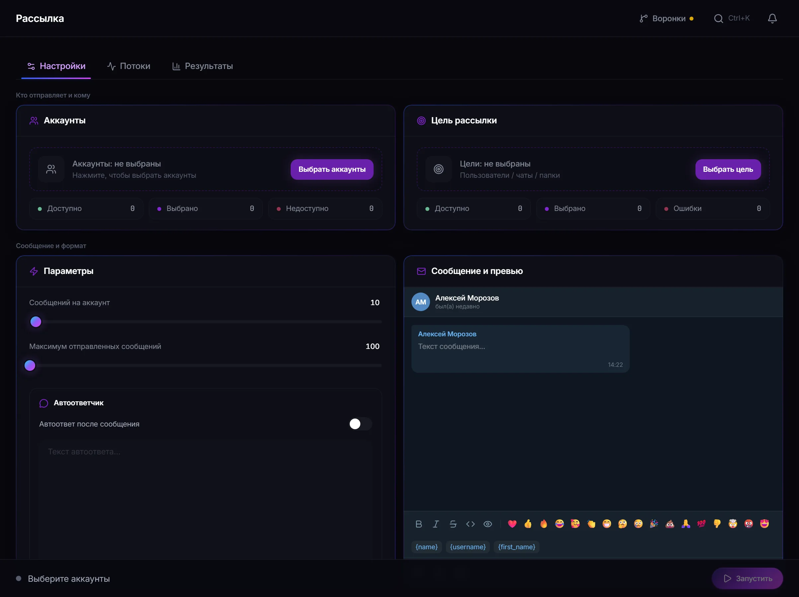

# Рассылка в Telegram через TeleGain

Рассылка отправляет подготовленное сообщение по выбранному источнику получателей от ваших аккаунтов. Текст задаётся несколькими вариантами, персонализируется данными получателя и дополняется медиа.

**[Полное руководство →](https://telegain-guides.github.io/modules/messaging/)**  ·  **[Официальная страница модуля →](https://telegain.net/ru/modules/mailing)**

---

## Кратко о модуле

| Параметр | Значение |
| --- | --- |
| Источники получателей | база, контакты, открытые диалоги аккаунтов, доступные чаты |
| Варианты текста | для каждого получателя выбирается один из подготовленных |
| Медиа | фото и видео, аудио, документы, голосовые |
| AI-уникализация | переписывает текст, сохраняя имена, данные и ссылку |

## Минимальный сценарий настройки

1. Выберите аккаунты и разрешённый источник получателей.
2. Подготовьте несколько вариантов текста и включите персонализацию.
3. Приложите медиа и задайте лимит сообщений на аккаунт.
4. Решите, нужен ли автоответ, и запустите.

## Интерфейс модуля

## Ограничения и правила платформы

- Наличие человека в базе не является согласием на получение сообщений.
- Оставляйте способ отказаться от дальнейших сообщений и уважайте отказ.
- Законодательство о персональных данных действует независимо от возможностей панели.
- Массовая отправка незнакомым людям ведёт к жалобам и ограничению аккаунта.

## Частые ошибки

| Ситуация | Что происходит |
| --- | --- |
| Сообщение не дошло | получатель закрыл ЛС от незнакомых пользователей |
| Получателей меньше базы | список уточняется перед отправкой, дубликаты отсеиваются |
| Аккаунт остановился | исчерпан лимит сессии или получен FloodWait |

## Связанные модули

- [Парсеры](https://github.com/telegain-guides/telegram-parser-telegain)
- [Прогрев аккаунтов](https://github.com/telegain-guides/telegram-account-warmup-telegain)
- [Нейрочат](https://github.com/telegain-guides/telegram-ai-chat-telegain)
- [Пулы аккаунтов](https://github.com/telegain-guides/telegram-account-pools-telegain)

## Документация

- [Полное руководство по модулю](https://telegain-guides.github.io/modules/messaging/)
- [Каталог всех модулей](https://telegain-guides.github.io/modules/)
- [Диагностика запусков](https://telegain-guides.github.io/troubleshooting/)
- [Ответственное использование](https://telegain-guides.github.io/responsible-use/)

---

TeleGain — независимый сервис. Он не принадлежит Telegram, не аффилирован с Telegram FZ-LLC
и не является официальным продуктом мессенджера. Telegram — товарный знак своего правообладателя.
